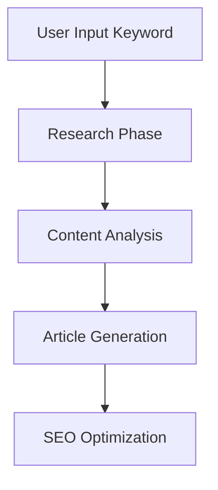

# Implementation Plan: SEO Content Generation

## Next Step: Implement Exa Search Tool
We need to implement the Exa search tool first because it will:
1. Research competitor content
2. Gather SEO insights
3. Provide context for our article generation

### Implementation Steps

1. **Exa Search Tool Implementation**
```python
# Example structure
from langchain_exa import ExaSearchResults
from langchain.tools import Tool

class ExaSearchTool:
    def search_competitors(keyword: str) -> list:
        """Search for top competitor content"""
        pass
        
    def analyze_seo_metrics(url: str) -> dict:
        """Analyze SEO metrics for a URL"""
        pass
```

2. **Content Research Agent**
- Use Exa tool to gather:
  - Top ranking articles
  - Common keywords
  - Content structure
  - SEO patterns

3. **Article Generation Flow**


### Why This Order?
1. **Research First**: We need competitive insights before generation
2. **Data-Driven**: Base our content on successful examples
3. **SEO Focus**: Ensure we have metrics to optimize for

### Implementation Timeline
1. Day 1: Exa Search Tool
2. Day 2: Content Research Agent
3. Day 3: Integration & Testing
4. Day 4: Article Generation

### Next Actions
1. [ ] Create ExaSearchTool class
2. [ ] Implement competitor search
3. [ ] Add SEO metrics analysis
4. [ ] Test with sample keywords 